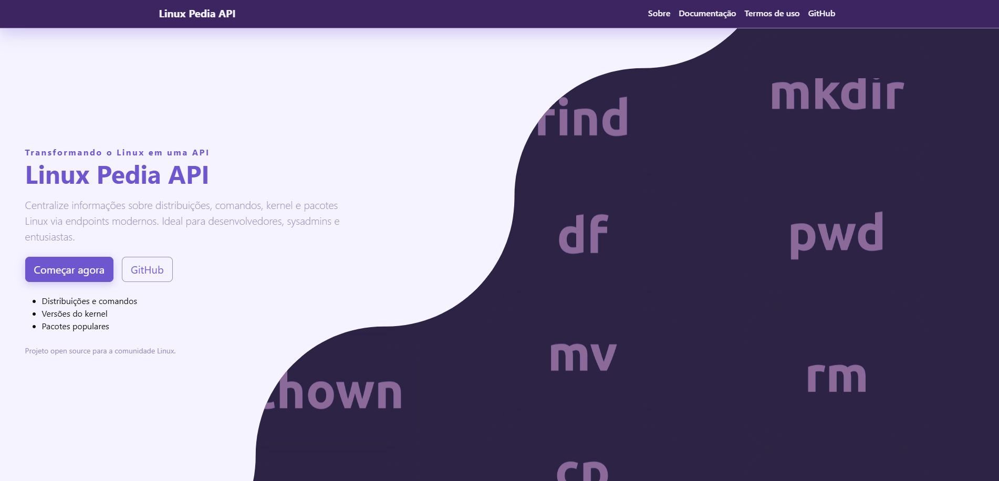

<h1 align="center">🐧 Linux Pedia API</h1>

  

    <strong>Transformando o Linux em uma API acessível para todos</strong>
  

  
  
  

---

## 🔧 Sobre o projeto

O acesso programático a informações sobre Linux é fundamental para desenvolvedores, sysadmins e entusiastas. O **Linux Pedia API** facilita a consulta de dados relevantes, promovendo o software livre e a colaboração.

Este projeto experimental centraliza e disponibiliza endpoints modernos para consulta sobre distribuições, comandos, kernel, pacotes e muito mais.

---

## 📖 Documentação

Consulte endpoints para:

- 🐧 Distribuições Linux (Debian, Ubuntu, Fedora, etc)  
- 🖥️ Comandos e exemplos de uso  
- 🧩 Versões do kernel  
- 📦 Pacotes populares  
- 📜 Histórico e curiosidades  

👉 Site oficial: [linux-pedia-api.vercel.app](https://linux-pedia-api.vercel.app/)

---

## 🖼️ Prévia

---

## 🚀 Tecnologias utilizadas

| Tecnologia | Logo | Descrição |
|------------|------|-----------|
| **Node.js** | 

 | Backend que alimenta a API com endpoints RESTful |
| **MongoDB** | 

 | Banco de dados NoSQL utilizado para armazenar informações |
| **HTML, CSS, JS** |    | Frontend da documentação |
| **Insomnia** | 

 | Testes e validação dos endpoints da API |
| **Vercel** | 

 | Plataforma de deploy e hospedagem do projeto |

---

## 🤝 Como contribuir

Este projeto é uma cooperação aberta! Sua contribuição é muito bem-vinda.

1. Fork este repositório  
2. Crie sua branch: `git checkout -b feature/nova-funcionalidade`  
3. Faça o commit das suas alterações: `git commit -m 'Adiciona nova funcionalidade'`  
4. Push para a branch: `git push origin feature/nova-funcionalidade`  
5. Abra um Pull Request  

---

## ⚠️ Termos de uso

O LinuxPedia API é uma iniciativa aberta para a comunidade. Por favor, não abuse deste serviço.

- Evite consultas automatizadas em massa ou crawling de todos os dados.  
- Para grandes volumes, entre em contato para soluções adequadas.

❌ Nunca faça:

- Requisições em loop para todos os comandos ou distribuições  
- Uso para fins maliciosos ou spam  

---

---

## 👥 Contribuidores

---

## 👨‍💻 Autores

<table>
  <tr>
    <td align="center">
      <a href="https://github.com/vito-ysl">
         
        @vito-ysl
      </a>
    </td>
    <td align="center">
      <a href="https://github.com/Rezys07">
         
        @Rezys07
      </a>
    </td>
    <td align="center">
      <a href="https://github.com/alex518123">
         
        @alex518123
      </a>
    </td>
  </tr>
</table>

---

## 📜 Licença
Este projeto está licenciado sob a [MIT License](./LICENSE).

---

✨ Feito com Carinho Para Toda a Comunidade de Linux 
